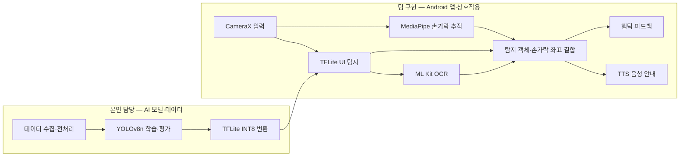
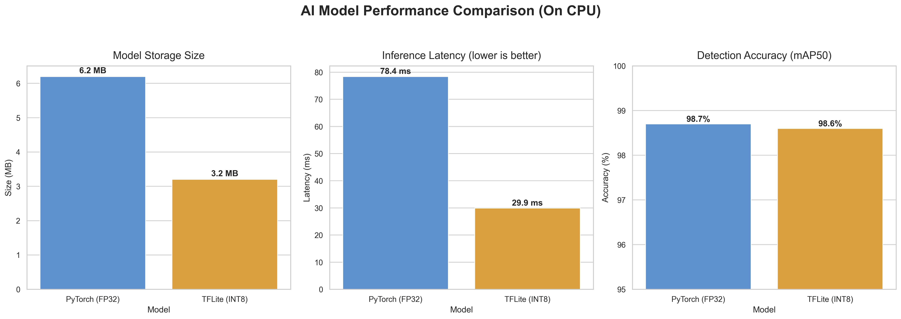
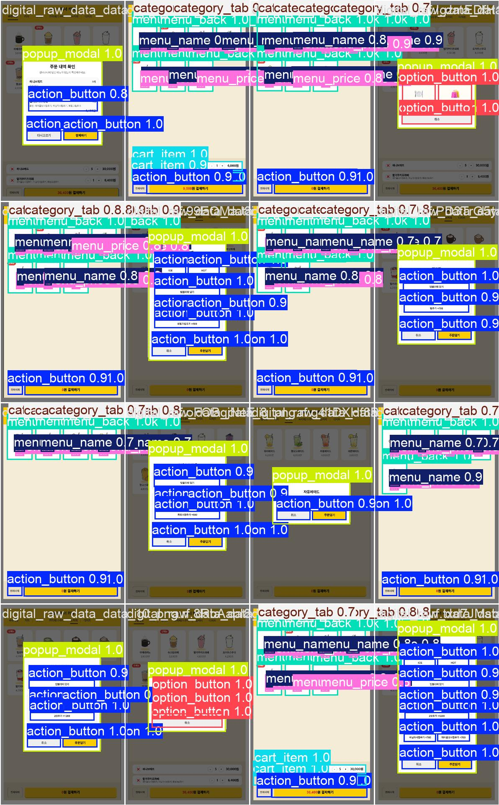

# AI Vision 기반 배리어프리 키오스크 보조 시스템

> 기존 키오스크를 교체하지 않고 스마트폰 카메라와 온디바이스 AI로 저시력 사용자의 조작을 돕는 접근성 보조 시스템

경기대학교 상상기업·캡스톤디자인 과정에서 진행한 **7인 팀 프로젝트**입니다. YOLOv8 기반 UI 요소 탐지, MediaPipe 기반 손가락 추적, TTS·햅틱 피드백을 결합했습니다.

> **기여 범위 안내**
> 본 README는 [cistus75](https://github.com/cistus75)의 **AI 모델·데이터 기여**를 중심으로 정리했습니다. Android 앱 구현은 팀원의 담당 영역이며 본인 기여 범위에 포함하지 않습니다.

## 주요 성과

- **2026 한국정보기술학회 하계종합학술대회 금상**
- **2026 캡스톤디자인 경진대회 최우수상**
- 학술대회 논문 **제1저자·교신저자**
- 디지털 캡처와 실사 촬영 데이터를 결합한 **387장 데이터셋** 구축
- YOLOv8n 모델 **mAP@0.5 98.7%** 달성
- TFLite INT8 변환 후 **mAP@0.5 98.6%**, 모델 크기 **3.2MB** 기록

| 구분 | 내용 |
| --- | --- |
| 프로젝트 | 경기대학교 상상기업 · 캡스톤디자인 |
| 팀 구성 | 7인 |
| 본인 담당 | 기획 · AI 모델 개발 · 데이터 수집·전처리 · 학습·평가 · 외부 협업 · 발표 · 논문 집필 |
| 본인 비담당 | Android 앱 구현 |

## 프로젝트 개요

기존 키오스크를 물리적으로 교체하는 방식은 도입 비용과 매장 환경의 제약이 큽니다. NewStart는 스마트폰 카메라로 기존 키오스크 화면을 인식하고, 사용자가 가리키는 위치를 추적해 음성과 진동으로 안내하는 보조 시스템을 제안했습니다.

### 핵심 기능

1. **UI 요소 탐지**: YOLOv8n으로 메뉴, 카테고리, 장바구니, 실행 버튼, 옵션, 팝업 영역 탐지
2. **손가락 위치 추적**: MediaPipe Hand Landmarker로 검지 끝 좌표 추적
3. **텍스트 인식**: 탐지 영역을 Google ML Kit OCR로 인식하고 메뉴 데이터와 매칭
4. **멀티모달 안내**: Android TTS와 진동 모터로 선택 대상과 조작 상태 안내

## 기술 스택과 역할 구분

| 영역 | 기술 | 담당 범위 |
| --- | --- | --- |
| 데이터·모델 | Python, YOLOv8n, Ultralytics, PyTorch, OpenCV | **본인 담당** |
| 학습·평가 | 387장 데이터셋, mAP 평가, PyTorch, RTX 4070 Ti, CUDA 11.8 | **본인 담당** |
| 온디바이스 변환 | TensorFlow Lite INT8 양자화 | **본인 담당** |
| 앱·통합 | Kotlin, Android, CameraX, MediaPipe, ML Kit OCR, OpenCV | 팀 구현 |
| 사용자 피드백 | Android TextToSpeech, Android Vibrator | 팀 구현 |

## 시스템 구조

## 본인 담당 역할

- 접근성 문제 정의와 카메라 기반 키오스크 보조 방식 기획
- 디지털 캡처·실사 촬영 데이터 수집, 라벨링 및 전처리
- 키오스크 UI 탐지 클래스 정의와 YOLOv8n 모델 학습·평가
- PyTorch 모델을 온디바이스 실행용 TFLite INT8 모델로 변환
- 모델 성능 비교와 탐지 결과 분석
- 외부 협업, 프로젝트 발표, 학술 논문 제1저자·교신저자로 집필

Android 앱의 카메라 파이프라인, MediaPipe 손가락 추적, OCR, TTS, 햅틱 연동은 팀원이 구현했습니다. 본인은 학습 모델과 데이터 산출물을 제공하고 앱 통합을 위한 AI 결과 형식을 정리했습니다.

## AI 모델 및 실험 결과

### 데이터셋과 탐지 모델

- 디지털 키오스크 캡처와 실사 촬영 데이터를 정제해 **387장**으로 구성
- YOLOv8n을 100 epoch, 640px 입력 크기로 학습
- UI 요소 8개 클래스를 학습하고, 앱에서는 텍스트 영역을 OCR로 분리해 비텍스트 객체 탐지 결과를 사용
- PyTorch FP32 모델 `mAP@0.5 98.7%`

### 온디바이스 변환

- TFLite INT8 양자화 후 모델 크기 `6.2MB → 3.2MB`
- PC CPU 측정 결과에서 추론 지연 `78.4ms → 29.9ms`
- 양자화 후 `mAP@0.5 98.6%`로 기록

> 실험 환경: Windows 11, AMD Ryzen 7800X3D, NVIDIA GeForce RTX 4070 Ti 12GB, RAM 32GB, Python 3.12.8, PyTorch 2.7.1(CUDA 11.8), YOLOv8 8.4.46, TensorFlow 2.19.0. 추론 지연은 모바일 기기가 아닌 PC 환경에서 측정한 결과입니다.

## 수상

| 한국정보기술학회 하계종합학술대회 금상 | 캡스톤디자인 경진대회 최우수상 |
| --- | --- |
|  |  |

## 상세 문서 및 코드

| 항목 | 링크 |
| --- | --- |
| AI 모델·데이터셋 개요 | [final_AI/README.md](./final_AI/README.md) |
| 모델 학습 스크립트 | [train_yolo.py](./final_AI/scripts/train_yolo.py) |
| TFLite 변환 스크립트 | [export_tflite.py](./final_AI/scripts/export_tflite.py) |
| 추론 코드 | [yolo_AI.py](./final_AI/yolo_AI.py) |
| 데이터셋 | [combined_dataset](./combined_dataset/) |
| 실험 결과 | [paper_results](./paper_results/) |
| Android 시스템 구조 | [CodeSpanner/readme.md](./CodeSpanner/readme.md) |
| 학술대회 논문 원문 | [저시력자를 위한 온디바이스 키오스크 이용 가이드 시스템 개발](./docs/저시력자를_위한_온디바이스_키오스크_이용_가이드_시스템_개발.pdf) |
| 기존 기술 스택 문서 | [Notion](https://www.notion.so/5b111acc0b5f4cabb94ee2adb12e0696) |

## 협업 방식

- GitHub Issues 기반 작업 관리
- 기능별 브랜치 생성
- Pull Request를 통한 `main` 브랜치 병합
- Conventional Commit 기반 커밋 메시지 관리
- Discord 및 KakaoTalk을 통한 협업

## 팀 정보

본 프로젝트는 경기대학교 상상기업·캡스톤디자인 과정의 **7인 팀 프로젝트**입니다. 이 README는 전체 시스템을 소개하되, 개인 포트폴리오 검토를 위해 최재우([cistus75](https://github.com/cistus75))의 AI 모델·데이터 기여를 중심으로 작성했습니다.

---

© 2026 Team NewStart. All rights reserved.
